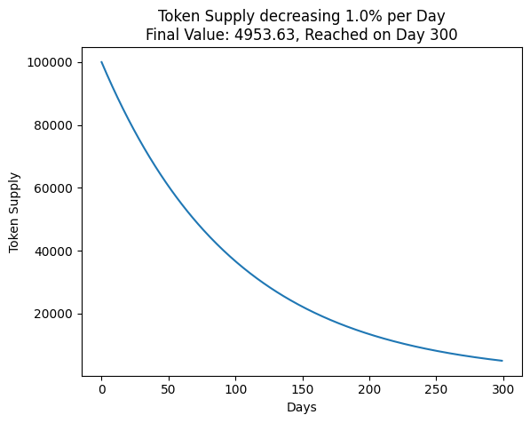

# Soldef Token

<div align="center">
     
</div>

**Soldef** is a proof of concept for an ERC20 token with deflationary properties.
Similar to elastic supply tokens, but with only debase and no rebase functionality.

Over time, the total supply of **Soldef** tokens is reduced. The balances of all token holders decrease proportionally.

## Contract address

This contract is deployed on the sepolia testnet. Here is the address:
0x00

## Tokenomics

<div align="center">
     
</div>

Formula for calculating the token supply after x days:
```
token_supply = initial_supply * (0.99 ^ days)
```

The **Soldef** contract inherits from the ERC20 contract provided by OpenZeppelin and adds several new features:

- _initialSupply is a public variable that stores the initial supply of the token.
- _totalSupplyLastUpdated is a public variable that stores the timestamp of the last time the total supply was updated.
- _minimumSupply is a public variable that stores the minimum supply of the token.
- _supplyDelta is a public variable that stores the rate of supply reduction per day (in percentage points).

The constructor initializes these variables and mints the initial supply of tokens to the contract deployer.
The debase() function calculates the time elapsed since the last supply update, the percentage of supply reduction, and the new supply of tokens. It then updates the total supply and burns the excess tokens.
The debase() function ensures that the new supply is not below the minimum supply.
Call the debase() function periodically to reduce the token supply.

## Tests
```
npx hardhat test --network hardhat
```

```
  Soldef Tests
    ✔ Deployer should have all of the INITIAL_SUPPLY (44ms)
    ✔ Check if last Block timestamp equals totalSupplyLastUpdated (48ms)
    ✔ totalSupply after 1 day should be 1% less of INITIAL_SUPPLY
    ✔ totalSupply after 299 days should almost reach MINIMUM_SUPPLY (4454ms)
```


## Deploy & verify
```
npx hardhat run scripts/deploySolrise.js --network sepolia
npx hardhat verify --network sepolia <address>
```

## Todo
- Write more (unit) tests
- Write stacking contract
- Create frontend with React/Next.js and ethers.js